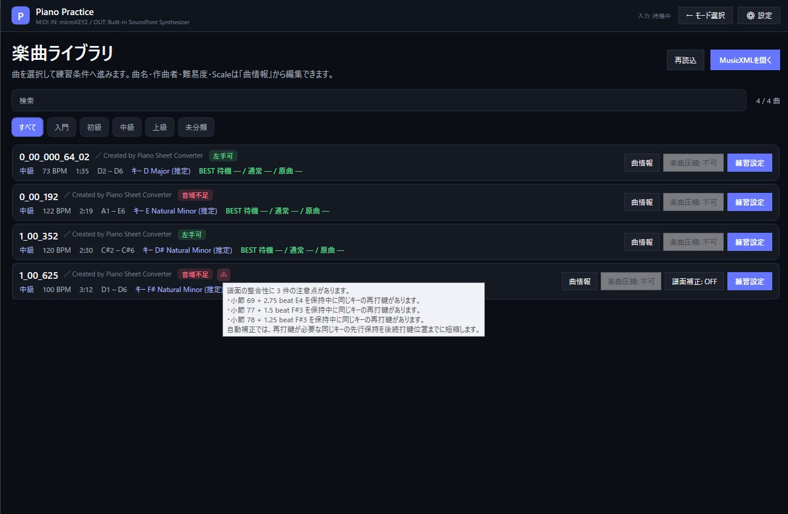
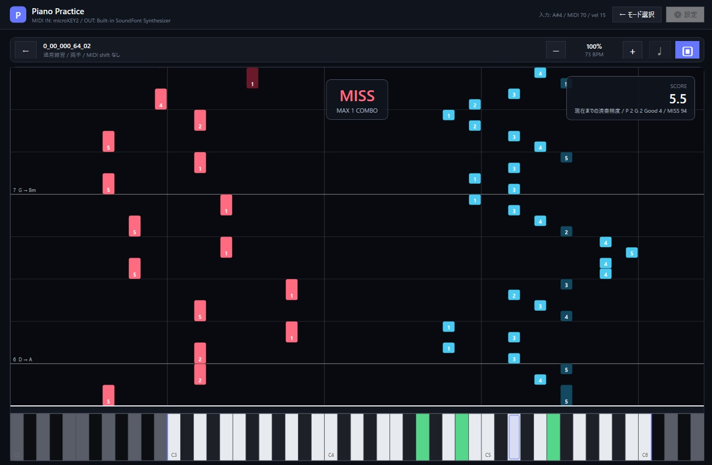
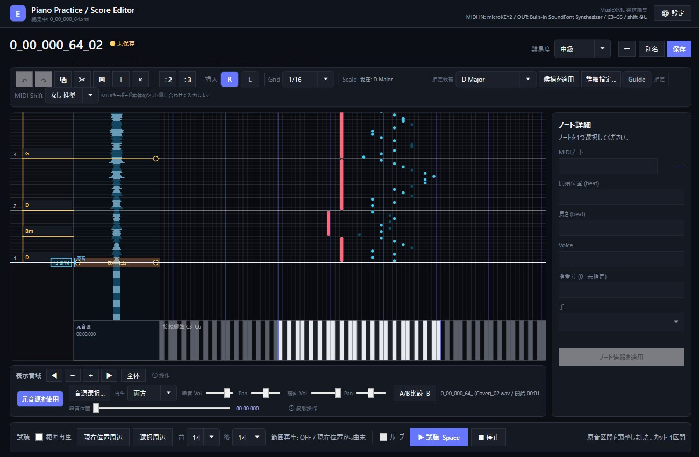
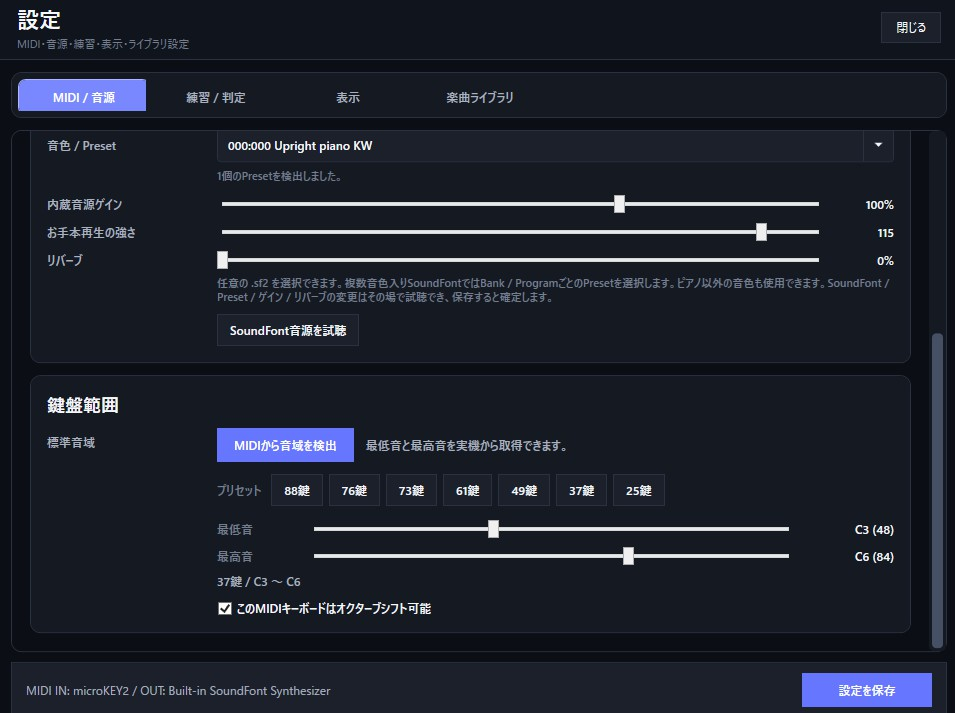

# Piano Practice Tool

MusicXMLとMIDIキーボードを使った、Windows向けのピアノ練習・楽譜編集ツールです。

インストール作業を前提とせず、展開したフォルダを基準に設定・練習履歴・楽曲データを管理するポータブル構成です。

## このツールについて

MusicXML楽譜を読み込み、MIDIキーボードを使った練習・採点・お手本再生・運指確認・楽譜編集に加え、元音源の波形と譜面を同期させた耳コピ補助まで、ひとつのアプリで行うためのツールです。

主な利用方法のひとつとして、ヤマハの **[Piano Sheet Converter](https://piano-sheet-converter.beta.yamaha.com/)** で作成・編集し、**MusicXMLとしてエクスポートした楽譜を読み込んでMIDIキーボードで練習する**流れに対応しています。

Piano Sheet Converterは、音源からピアノ譜を自動生成し、PDF・MIDI・MusicXMLへ書き出せるヤマハのアプリです。MusicXMLエクスポートの利用条件や対応プランなどは変更される可能性があるため、最新情報は公式ページを確認してください。

> このPiano Practice Toolは個人用途から始まった非公式プロジェクトであり、ヤマハ株式会社およびPiano Sheet Converterの公式製品・関連製品・提携製品ではありません。Piano Sheet Converterで生成・出力した楽譜やMusicXMLの利用については、同サービスの利用規約および各楽曲の権利条件に従ってください。

## 動作イメージ

### 起動画面


### 練習モード

#### 曲選択


曲名の横には、現在の鍵盤範囲で利用できる練習方法を必要な分だけタグ表示します。たとえば、圧縮なしでは片手練習が可能で、楽曲圧縮後なら両手で弾ける場合は「片手可」と「圧縮で両手可」を併記します。

譜面の整合性に注意が必要な場合は警告マークを表示し、自動補正できる内容がある曲では「譜面補正」をON / OFFできます。



警告マークにマウスを合わせると、同じ鍵を保持中に再打鍵している位置など、検出した問題を確認できます。譜面補正をONにしても元のMusicXMLは変更せず、練習用データだけを補正します。

#### 練習設定


#### 演奏画面



### 編集画面



編集画面では、小節 / コード / Tempoを扱うタイムライン、ピアノロール、必要なときだけ表示できる元音源の波形レーンを同じ時間軸で確認できます。ノート編集だけでなく、原曲を聴きながらMusicXMLとの位置を合わせ、ピアノアレンジに含めない区間を「カット」として残したまま試聴できます。

### 設定画面



## Features

### ピアノ練習

- 楽曲ライブラリ
  - 曲名・作曲者・難易度・キー / スケール・音域・BESTを一覧表示
  - 一度解析したMusicXMLは内容ハッシュ付きのカタログキャッシュへ保存し、変更がなければ練習モード / 編集モードの曲一覧で解析結果を再利用
  - 曲名・作曲者・難易度・Tonic / Scale種類を「曲情報」画面から編集
  - 鍵盤範囲は両手 / 右手 / 左手を個別判定し、「両手可」「片手可」「右手可」「左手可」などを小型タグで表示
  - 圧縮前後の有用な情報は分けて表示。たとえば圧縮なしで片手、楽曲圧縮後なら両手で弾ける曲は「片手可」+「圧縮で両手可」と確認可能
  - 現在の鍵盤範囲に収まらない曲は、対応可能な場合に楽曲オクターブ圧縮を選択可能
  - 同じ鍵の保持中に再打鍵を要求する等、譜面の整合性に問題が見つかった曲は警告マークを表示。マウスを合わせると検出位置と内容を確認可能
  - 自動補正可能な問題は「譜面補正」を曲ごとにON / OFF可能。補正後も警告が残る場合は、自動補正できない内容が含まれるため元譜またはエディタでの確認が必要
  - 譜面補正は練習用データだけへ適用し、元のMusicXMLは変更しない
- 待機練習
  - 正しい鍵盤を弾くまで進行を停止
  - 単音・和音の正誤判定
- 通常練習
  - ノートの流れに合わせて演奏
  - タイミング、誤鍵、見逃しを評価
- 原曲テンポ練習
- お手本再生
  - Spaceキーで再生 / 一時停止 / 再開
  - 再生位置スライダー、現在時間 / 総時間、小節番号表示
  - スライダーで移動した位置から再開
  - 一時停止中はピアノロール上のホイールで1拍ずつ前後へ移動、Shift+ホイールで小節単位へ移動
  - Rキーで今回の再生開始位置へ戻り、同じ箇所を繰り返して暗譜確認
- 両手 / 右手 / 左手練習
- MusicXMLのstaffを基準にしつつ、実演上明らかに反対の手で取る方が自然な単音は練習用の左右手割当を自動補正
  - 短時間の大きな跳躍を、反対の手へ渡すことで明確に減らせる孤立音も保守的に補正
- 自動運指は前後の流れをまとめて評価し、黒鍵の親指、親指くぐり、不要な手移動、同音での頻繁な指替え等を考慮
  - 保持中の同じ手のノートは指位置を固定し、その保持音を跨いで物理的に成立しない指配置を候補から除外
  - 黒鍵の親指は一律禁止せず、オクターブ / 和音等で自然な場合は使用
  - MusicXMLに明示された運指は保持し、未指定部分を自動生成
- 左右手の色分け表示を設定でON / OFF可能
  - 運指番号は色分けON時だけ独立してON / OFF可能
- 10%〜200%の速度変更
- 区間ループ
- MIDIキーボード本体のオクターブシフト量を練習設定画面で選択
- カウントイン / メトロノーム
  - お手本再生は1小節
  - 練習モードはテンポと速度に応じて1〜2小節（長くなりすぎないよう調整）
- ピアノロールの表示範囲はテンポ / 練習速度とは独立して固定
- ピアノロールの小節番号とコード名表示
  - MusicXML記載コードを優先
  - 記載がない場合は十分判断できる小節のみ推定し、推定コードには `?` を付加
- 練習スコア、履歴、BEST表示
- 待機練習時の平均BPMと原曲テンポ比率

### MusicXML

- `.xml` / `.musicxml` 読込
- [Yamaha Piano Sheet Converter](https://piano-sheet-converter.beta.yamaha.com/) からエクスポートしたMusicXMLを主な想定入力のひとつとして対応
- `backup` / `forward` / `chord` / voice / staff
- tie
- 休符
- 拍子
- 調号 / key mode
- `harmony` によるコード情報
- テンポイベント
- テンポ変更を含む時間変換
- 複数フォルダの再帰探索

### 楽譜編集

- コンパクトな編集ツールバー
- 右手 / 左手のノート挿入モード
  - `R` / `L` キーで切り替え
  - ダブルクリック挿入は現在の手モードを使用
- ノート挿入 / 削除 / 移動 / 長さ変更
- 単一・複数・矩形選択
- 2分割 / 3分割
- コピー / 切り取り / 貼り付け / 複製
- 左手 / 右手変更
- Undo / Redo
- グリッド / スナップ
  - 1/4、1/8、1/16、1/32
  - 1/4三連、1/8三連、1/16三連
- MusicXMLに含まれる休符情報は保存時に保持
  - ピアノロール上には休符ノードを表示しません
- 表示音域の移動・ズーム
- 小節単位の編集
  - 左レーンの小節を右クリックして、前 / 後への空小節挿入、小節削除、拍子変更、テンポ設定
  - 曲末の小節で「後に空小節を挿入」を選ぶと小節を追加
  - 拍子変更では小節長を再計算し、後続のノート、コード、Tempo、Key / Scaleも自動調整
  - テンポ変更点はタイムライン上にBPM表示
- 左タイムラインレーンから現在位置を移動
  - クリックで指定位置へ移動
  - ドラッグで盤面をスクロール
  - 「タッチスクロール（惰性あり）」 / 「直接追従」を設定で選択
- 範囲試聴 / ループ試聴
  - 範囲再生ON / OFF
  - 現在位置周辺 / 選択ノート周辺
  - 前後0 / 1 / 2 / 4小節を選択
  - Spaceキーで再生 / 一時停止 / 再開
- 耳コピ補助 / 元音源同期
  - 「元音源を使用」がOFFのときは元音源レーンと関連操作を非表示
  - ONにすると縦型の波形レーンを表示
  - 元音源ファイルとMusicXMLを複数の同期ポイントで対応付け
  - 再生は「譜面」「原音」「両方」を切り替え可能
  - 原音と譜面の音量を個別調整
  - 原音と譜面のPanを個別調整し、左右へ振り分けて比較可能
  - 波形クリックで原音位置を直接移動、ダブルクリックでその位置から原音再生
  - 元音源レーンをShift+ドラッグして区間単位で同期を調整。曲頭では開始位置、同期点以降では区間の前後境界、曲末では譜面終了位置を調整でき、ピアノアレンジに含めない差分は「カット」として保持
  - Alt+クリックでクリック位置の最寄りGridへ同期ポイントを追加。再生位置は動かさず、同期点ドラッグで譜面位置を調整
  - 選択した同期点はShift+ホイールで原音側を±50ms調整、右クリック / Deleteで削除
  - 同じ譜面位置へ2つの元音源時刻を置くことで、ピアノ譜に含めないイントロ / 間奏 / アウトロ等を「カット区間」として保持
  - 「両方」再生やA/B比較ではカット区間を待たずに即時スキップ。原音単独の直接試聴ではカット前の音源も確認可能
  - カット区間は波形レーン上の帯として表示し、帯上クリックで区間内を直接移動
  - A/B比較で同じ範囲を「原音 → 譜面」の順に連続再生。Bキーでも開始
  - 小節挿入 / 削除 / 拍子変更時は同期ポイントの譜面位置も自動調整
- 左タイムラインレーンにコード名を表示
  - 推定コードは文字の `?` ではなく表示色で区別
  - コード名をダブルクリックして、そのコード開始位置の指定を追加・変更・削除
  - 編集対象の有効区間をレーン上で確認可能
  - 候補リストから選択でき、候補外のコード名も直接入力可能
  - 9th / 11th / 13thなどの拡張コードもMusicXMLへ保存可能
- Key / Scale補助
  - Scale推定は複数候補を表示し、TonicとScale種類をユーザーが修正可能
  - Major / Natural Minor / 各Diatonic Modeに加え、Harmonic Minor / Melodic Minor / Pentatonic / Blues / Whole Tone / Chromaticを選択可能
  - 標準MusicXMLで表現できるModeは `key/fifths` + `mode`、それ以外は補助メタデータと組み合わせて保存
  - Scale Guideは `K` でON / OFFし、転調位置に合わせて時間区間ごとに表示
  - `H` を押している間、各コードの有効区間にだけ対応するコード構成音を強調
- Alt + 左ドラッグ / 中ボタンドラッグで時間・音域方向へパン
  - 時間方向は左タイムラインレーンと同じ「タッチスクロール / 直接追従」設定を使用
  - 音域方向への移動は設定から無効化可能
- 曲情報編集
  - 曲名 / 作曲者 / 難易度 / Tonic / Scale種類
- MusicXML保存
  - key mode / harmony / 休符情報を保持
- 編集途中の作業保存 / 再開
  - 「作業保存」または `Ctrl+Shift+S` で、MusicXMLを確定せず現在の編集状態を保存
  - MusicXMLと同じ場所の `<MusicXML>.pianopractice.editor.json` に、編集中の譜面、難易度、元音源設定、現在位置、Grid、選択ノート、表示範囲などを保存
  - 次回そのMusicXMLを編集するときに作業データを読み込むか確認し、「作業を再開」または「MusicXMLのみ」を選択可能
  - 元のMusicXMLが作業保存後に外部で変更されている場合は警告してから選択
  - 通常の「保存」でMusicXMLへ確定すると対応する作業用ファイルは削除

#### 耳コピ補助の基本操作

元音源同期は、録音を加工してしまう機能ではありません。MusicXMLの譜面位置と元音源の時刻の対応だけを保存するため、元の音声ファイルはそのまま残ります。

1. 編集画面で「元音源を使用」をONにし、耳コピ元の音声ファイルを選びます。
2. 曲頭がずれている場合は、元音源レーンを `Shift + ドラッグ` して譜面の開始位置と合わせます。
3. 曲の途中でずれが気になる位置は `Alt + クリック` で同期ポイントを追加します。クリック位置は現在のGridへスナップし、再生位置は移動しません。
4. 同期ポイント間で原曲にだけ存在する間奏などがある場合は、元音源レーンを `Shift + ドラッグ` して対象区間を調整します。余った元音源区間は「カット」として表示されます。
5. 「両方」再生やA/B比較で確認します。カット区間は同期再生では即時スキップされますが、波形を直接操作すれば元音源として内容を確認できます。

同期情報、開始 / 終了位置、カット区間、音量、PanなどはMusicXMLの隣の `.pianopractice.audio.json` に保存されます。

### MIDI / 音源

- Windows MIDI入力
- Note On / Note Off / Control Change
- サステインペダル等のCC入力
- 内蔵SoundFont音源
- 外部MIDI OUT
- MIDI入力中の鍵盤ハイライト
- SoundFont選択 / Preset選択 / ゲイン / アプリ側ステレオリバーブ / 自動演奏Velocity設定

### SoundFont

内蔵音源はSoundFont 2（`.sf2`）を使用します。本体には動作確認用・初期音源として、FreePatsの **Upright Piano KW Small SF2** を同梱します。

- 既定SoundFont: **Upright Piano KW Small SF2**
  - 約5.8 MiB（展開後約10 MiB）
  - Creative Commons CC0 1.0
  - [FreePats - Acoustic Grand Piano](https://freepats.zenvoid.org/Piano/acoustic-grand-piano.html)
- 設定画面から任意の `.sf2` ファイルへ変更できます
- 複数音色を含むSoundFontでは、Bank / ProgramごとのPresetを選択できます
- ピアノ音色を含まないSoundFontも選択できます
- SoundFont / Preset / ゲイン / リバーブは設定画面を開いたまま試聴できます
- リバーブはSoundFont内の設定に依存せず、Piano Practice Tool側のステレオリバーブとして適用します
- アプリ配下のSoundFontは相対パスで保存されるため、アプリフォルダごと移動できます
- アプリ外のSoundFontを選択した場合は、その外部ファイルを引き続き参照します

#### おすすめSoundFont

いずれも **SF2版** を選んでください。以下はFreePats公式で配布されている候補です。

| SoundFont | 目安 | SF2サイズ | ライセンス |
| --- | --- | ---: | --- |
| **Upright Piano KW Small** | 既定・軽量。まず試すならこれ | 約5.8 MiB | CC0 1.0 |
| **Upright Piano KW** | 容量を抑えつつ既定版より高音質 | 約27 MiB | CC0 1.0 |
| **YDP Grand Piano** | 中程度の容量で別系統のグランドピアノ音色 | 約36 MiB | CC BY 3.0 |
| **Salamander Grand Piano** | 容量より音質重視 | 約296 MiB | CC BY 3.0 |

ダウンロード先: [FreePats - Acoustic Grand Piano](https://freepats.zenvoid.org/Piano/acoustic-grand-piano.html)

既定のUpright Piano KW Small以外は本ツールへ同梱していません。利用したいSoundFontを各自でダウンロードし、「設定」→「MIDI / 音源」から `.sf2` を選択してください。CC BYなど帰属表示を要求するSoundFontを再配布する場合は、配布元のライセンス条件に従ってください。ツールに同梱されているSoundFontは本プロジェクトの0BSDライセンスの対象にはなりません。

### 運指・鍵盤範囲

- 楽曲一覧にキー / スケール名を表示
  - MusicXMLのkey / modeを優先
  - mode等が不足する場合は十分な音情報があるときだけ「(推定)」として表示
- 左右の手ごとの自動運指
- 運指の手動編集
- 楽曲ごとの必要鍵盤範囲解析
- 一般的な鍵盤数に合わせた互換性表示
- 楽曲オクターブ圧縮
  - 曲側の音をオクターブ単位で移動し、現在の鍵盤範囲へ収められる場合に利用可能
  - 和音の配置を保てない場合は圧縮不可
- MIDIキーボード本体のオクターブシフトに対応
  - 楽曲圧縮とは別に、練習設定画面でシフト量を選択

## Quick Start

1. 配布ファイルを任意のフォルダへ展開します。
2. `PianoPracticeTool.exe` を起動します。
3. 初回起動時にアプリと同じ場所へ `score_data` フォルダが作成されます。
4. 練習したいMusicXMLを `score_data` に入れます。Piano Sheet Converterを使う場合は、同アプリからMusicXMLとしてエクスポートしたファイルを使用できます。
5. 「設定」でMIDI入力、発音先、SoundFont / Preset、鍵盤範囲を確認します。
6. 起動画面から「練習モード」または「編集モード」を選びます。
7. 練習モードでは曲を選び、必要に応じて楽曲圧縮を設定してから「練習設定」へ進みます。

別の楽曲フォルダも設定画面から追加できます。練習画面上部の「← モード選択」から起動画面へ戻れます。

曲一覧の解析キャッシュはアプリ直下の `song-catalog-cache.json` に自動保存されます。MusicXMLや運指情報が変わった曲だけ再解析し、削除されたMusicXMLの項目は自動的に整理します。キャッシュは削除しても次回の曲一覧表示で再作成されます。

## Portable Data

アプリは実行ファイルのあるフォルダを基準にデータを保存します。

```text
PianoPracticeTool/
├─ PianoPracticeTool.exe
├─ piano-practice-settings.json
├─ practice-history.json
├─ score_data/
├─ SoundFonts/
│  └─ UprightPianoKW-small-20190703.sf2
├─ docs/
│  ├─ index.html
│  └─ sample_images/
├─ LICENSE
└─ THIRD_PARTY_NOTICES.txt
```

- `piano-practice-settings.json`: アプリ設定
- `practice-history.json`: 練習履歴
- `score_data/`: 既定楽曲フォルダ
- `SoundFonts/`: 既定SoundFontおよび任意で追加したSoundFontの配置先
- `<MusicXML>.pianopractice.json`: 運指メタデータ
- `<MusicXML>.pianopractice.audio.json`: 耳コピ用の元音源パス、再生モード、音量、Pan、同期ポイント

アプリ配下の `score_data` や楽曲参照はアプリ位置を基準に保持されるため、フォルダごと移動して使用できます。  
設定で追加したアプリ外部の楽曲フォルダは、その外部フォルダの場所を引き続き参照します。

## Editor Controls

| 操作 | 機能 |
| --- | --- |
| ダブルクリック | 現在の R / L 挿入モードでノート挿入 |
| R / L | 右手 / 左手ノート挿入モード |
| K | Scale Guide ON / OFF |
| H（押下中） | 各コード区間の構成音を、その時間位置だけ強調 |
| Alt + 左ドラッグ / 中ボタンドラッグ | 時間・音域方向へパン（音域方向は設定で無効化可） |
| ドラッグ | ノート移動 |
| ノート上端ドラッグ | 長さ変更 |
| Ctrl + クリック | 複数選択 |
| Ctrl + Z / Y | Undo / Redo |
| Ctrl + C / X / V / D | コピー / 切り取り / 貼り付け / 複製 |
| Delete | 削除 |
| Space | 試聴 / 一時停止 / 再開。元音源ON時は選択した「譜面 / 原音 / 両方」モードで再生 |
| ← / → | 選択ノートを半音単位で移動 |
| Shift + ← / → | 選択ノートを1オクターブ移動 |
| Ctrl + ← / → | 選択ノートを位置ごとのScale内で隣の構成音へ移動 |
| ↑ / ↓ | 選択ノートを時間軸方向へGrid単位で移動 |
| Shift + ↑ / ↓ | 選択ノート長をGrid単位で変更 |
| Home / End | 曲頭 / 曲末へ移動 |
| Ctrl + Shift + ホイール | 上で曲末、下で曲頭へ移動 |
| 元音源波形をクリック | 原音位置を直接移動。「カット」帯では横位置で区間内時刻を指定 |
| 元音源波形をダブルクリック | その原音位置から再生 |
| Shift + 元音源レーンをドラッグ | 曲頭区間は開始位置。同期点以降は下=開始側 / 上=終了側を調整し、差分を「カット」として保持。同期再生では即時スキップ |
| Alt + 元音源波形クリック | クリック位置の最寄りGridへ同期ポイントを追加。再生位置は移動しない |
| 同期ポイントをドラッグ | 同期ポイントの譜面位置を調整 |
| Shift + ホイール（同期点選択中） | 同期ポイントの原音位置を50ms単位で微調整 |
| 同期ポイントを右クリック / Delete | 同期ポイントを削除 |
| B / A/B比較 | 範囲再生、選択箇所、または現在小節を原音→譜面の順で比較 |
| 左タイムラインレーンの小節番号側をクリック | クリック位置へ現在位置を移動 |
| 左タイムラインレーンを右クリック | 空小節の挿入 / 小節削除 / 拍子変更 / テンポ設定・変更削除 |
| 左タイムラインレーンをドラッグ | 盤面を掴んで時間方向へ移動。設定により惰性スクロール可 |
| ホイール | 現在位置を時間方向へ移動。試聴中は停止して移動先を次の再生開始位置に設定 |
| Shift + ホイール | 高速時間移動 |
| Ctrl + ホイール | 時間ズーム |
| Alt + ホイール | 音域移動 |
| Alt + Shift + ホイール | 音域ズーム |

詳しい操作方法は `docs/index.html` を参照してください。

## Settings

設定ウィンドウは起動画面、練習モード、編集モードから開けます。

- MIDI / 音源
- 練習 / 判定
- 表示
  - ピアノロール表示範囲、運指、課題音ガイド
  - 編集タイムラインの「タッチスクロール（惰性あり）」 / 「直接追従」
- 楽曲ライブラリ

の4カテゴリに分かれています。

## Build from Source

### Requirements

- Windows
- Visual Studio 2022
- .NET 7 SDK / Windows Desktop Runtime

### Build

1. `PianoPracticeTool.sln` を開きます。
2. NuGetパッケージを復元します。
3. `PianoPracticeTool` をビルドします。

初回ビルド時にFreePats公式のUpright Piano KW Small SF2アーカイブを取得し、CC0の既定SoundFontとしてビルド出力へ配置します。追加SoundFontはビルドへ含めず、利用者が任意のSF2を選択します。

## Third-party Components

主な第三者コンポーネント:

- NAudio
- MeltySynth
- Upright Piano KW / FreePats

SoundFontを含む第三者ライセンスと帰属情報は `src/PianoPracticeTool/THIRD_PARTY_NOTICES.txt` を参照してください。

## User Guide

オフライン利用ガイド:

- `docs/index.html`

Build / Publish出力にも同梱されます。

## Project Background

Piano Practice Toolは個人利用のための練習環境を出発点として開発している非公式プロジェクトです。機能要件や操作設計は実際の練習・編集用途を基準に更新しています。実装コーディングやドキュメント整理にはOpenAIのChatGPTを活用しています。

## License

このプロジェクト独自のソースコードとドキュメントは **Zero-Clause BSD License (0BSD)** です。

利用、複製、改変、再配布、商用利用を目的や有償・無償を問わず許可します。  
作者による保証はなく、利用によって生じた損害等について作者は責任を負いません。

正式な条件はルートの `LICENSE` を参照してください。

NAudio、MeltySynth、Upright Piano KW / FreePatsなどの第三者成果物には、それぞれのライセンスが適用されます。詳細は `src/PianoPracticeTool/THIRD_PARTY_NOTICES.txt` を参照してください。
